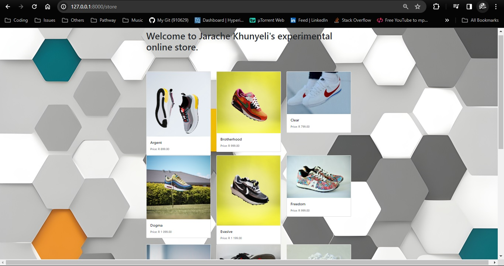
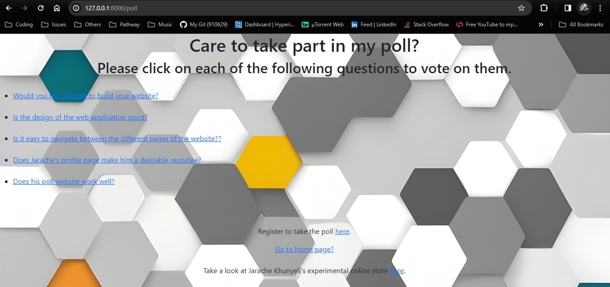
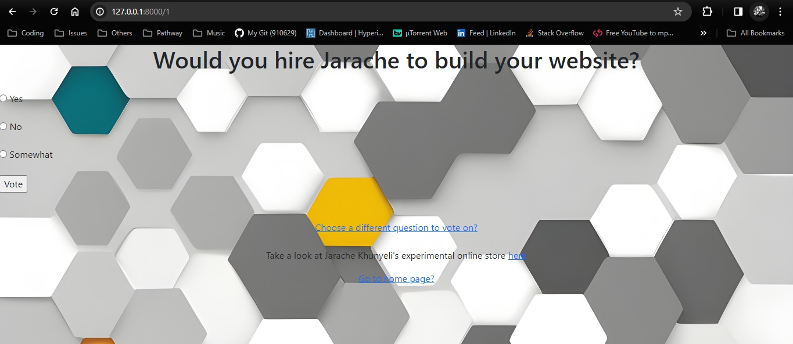
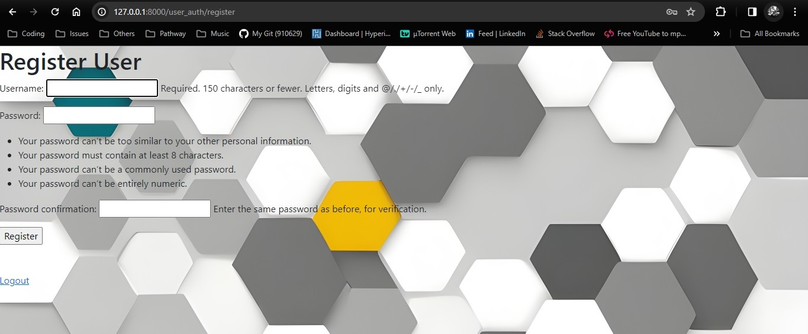
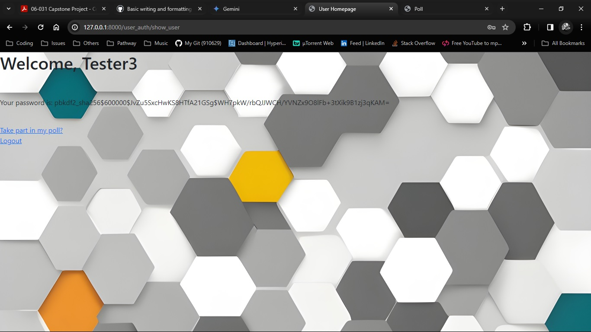
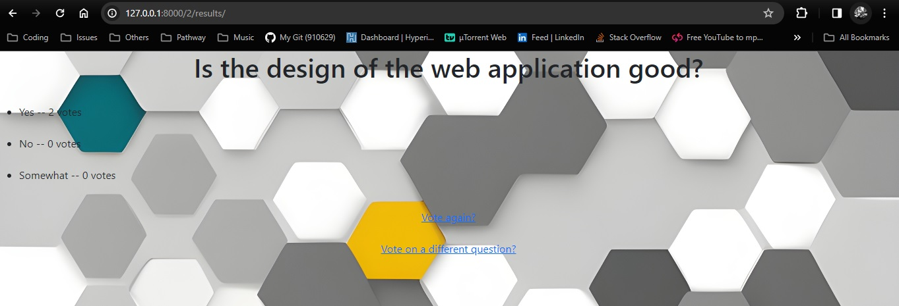

# **Jarache Django Application**
[Jarache Django Application](https://github.com/910629/Jarache)

This Django application showcases Jarache Khunyeli's skills in various areas:
* Building and querying Django databases
* Implementing user login, registration, and authentication using Django's built-in modules
* Demonstrating HTML and CSS styling abilities

It also affords users the opportunity to give feedback on Jarache's skills.

## Table of Contents
1. Installation
 * Prerequisites
 * Installation Methods
  * Direct Installation (Without Docker; using IDE)
  * Using Docker Playground
  * Using Docker (Desktop Application)
 * Running the Application
  * Direct Execution (Without Docker; using IDE)
  * Using Docker Playground
  * Using Docker (Deskop Application)

2. Usage
 * Navigation
  * Navigating *Jarache Khunyeli's Bio*
  * Navigating *Mike Store - Online Store*
  * Navigating *Poll*

3. Credits
 * Contributions
 * Licenses

## Installation
 ### Prerequisites:
  #### Using IDE/Docker Desktop App:
   __Python__: This application requires Python version 3.10 or higher. 
   You can download and install Python from the official website: [Download Python](https://www.python.org/downloads/)

  #### Using Docker Playground:
   Although this application requires python version 3.10 or higher, Docker Playground provides a pre-configured Python environment.
 
 ### Installation Methods:
  #### Direct Installation (Without Docker; using IDE):
   1. Install Python (see Prerequisites for link).
   2. Clone the *Jarache* repository.
    ''' 
    git clone https://github.com/910629/Jarache 
    '''

  #### Using Docker Playground:
   1. Within the Docker Playground terminal, use Git commands to clone your repository.
    ''' 
    git clone https://github.com/910629/Jarache 
    '''

  #### Using Docker (Desktop Application):
   1. Install Docker: If you don't have Docker installed, download and install it from the official website: 
   [Docker:get started](https://www.docker.com/get-started)

 ### Running the Application
  #### Direct Execution (Without Docker; using IDE):
   1. After successful installation, you can run the development server using:
    '''
    python manage.py runserver
    '''
    This will start the Django development server, typically accessible at http://127.0.0.1:8000/ in your web browser.

  #### Using Docker Playground:
   1. Navigate to the project directory:
    '''
    cd Jarache
    '''
   2. Run the development server:
    '''
    python manage.py runserver
    '''
   This will start the Django development server within the container. Docker Playground will typically display the assigned port for accessing the application (usually in the logs or UI).

  #### Using Docker (Deskop Application):
   1. Run the container:
    '''
    docker run -p 8000:8000 jarache_image
    '''
    This command runs the built Docker image (Jarache_image) and maps the container's port 8000 (where Django runs) to your host machine's port 8000.
   2. Access the application:
    The application should now be accessible in your web browser at http://localhost:8000/.

## Usage
 ### Navigating *Jarache Khunyeli's Bio*
  Once the application is running and you've accessed it, you will have landed on the *Jarache Khunyeli's Bio* page.
  Please analyze the page and elements before clicking on any links.

  

  To access Jarache's experimental online store's page, click on *store website*.

  

  To access Jarache's skills poll page, click on *poll*.

  

  The page also provides links to Jarache's LinkdIn and GitHub profiles.

  

 ### Navigating *Mike Store - Online Store*
  If on *Jarache Khunyeli's Bio* you clicked on *store website*, This is the page you will be seeing:
  Please analyse the page and all its elements befor clicking on any links.
  **Note: You will not be able to purchase any products as yet, since the page is only being used for display purposes.**

  

  Once you've analyzed the page and all its elements, you can scroll to the bottom of the page.
  You'll notice that it also features a form which captures user's details:
  **Note: For display purposes only.**

  

  If you'd like to return to *Jarache Khunyeli's Bio*, click on the *Back to Developer's Profile* link
  Or alternatively, if you'd like to participate in the poll, click on the *Take a poll Jarache Khunyeli's Developer Skills* link.

  

 ### Navigating *Poll*
  If you clicked on the *poll* link on the *Bio* page, or the *Take a poll Jarache Khunyeli's Developer Skills* link 
  on the *Mike Store - Online Store* page; This is the page you'll be directed to:

  

  **Important: You need to be registered in order to vote on any of the questions.**
  However, you may click on each question to view their respective *Details* page before registering to vote:

  

  If you select one of the radio buttons on a question's *Details* page, or if you clicked on the linked labeled *here*
  on the *Poll* page: This is the page you'll be directed to.

  

  This page diplays a form for you to enter a *username, unique password, and validate your password* (insructions included).
  Once you've done this successfully (without any errors) and clicked on *submit*, you will be directed to the *User Homepage*:

  

  Notice that your username is displayed, but your password is automatically hashed for security purposes.
  So, please make sure you remember it for future reference.

  Now you are ready to vote. Click on the *Take part in my poll* link. Or alternative, click on *logout* if that's what you wish to do.
  Once you have selected a question to vote on, chosen an option, and clicked on *Vote*: 
  You will be directed to the question's *Results* page. 

  

## Credits
 ### Contributions
  This application was built by Jarache Khunyeli, 
  with the much appreciated help of Hyperion Development, w3schools.com and stackoverflow.com. 

 ### Licenses
  The Jarache application utilizes the following open-source licenses:
   * Django (4.2.6) - BSD 3-Clause "New" or "Revised" License: https://opensource.org/licenses/BSD-3-Clause
   * alabaster (0.7.16) - BSD-3 Clause License
   * asgiref (3.7.2) - MIT License: https://github.com/django/asgiref/blob/master/LICENSE
   * Babel (2.14.0) - MIT License: https://github.com/python-babel/babel/blob/master/LICENSE
   * certifi (2023.7.22) - Apache License 2.0
   * charset-normalizer (3.3.2) - BSD License
   * colorama (0.4.6) - MIT License
   * distlib (0.3.7) - MIT License
   * docutils (0.20.1) - Public Domain
   * filelock (3.12.4) - MIT License
   * idna (3.6) - MIT License
   * imagesize (1.4.1) - MIT License
   * Jinja2 (3.1.3) - BSD 3-Clause License
   * MarkupSafe (2.1.5) - BSD 3-Clause License: https://github.com/pallets/markupsafe/blob/master/LICENSE.rst
   * packaging (23.2) - PSF (Python Software Foundation) License: https://github.com/pypa/packaging/blob/master/LICENSE
   * pipenv (2023.10.24) - MIT License:
   * platformdirs (3.11.0) - MIT License:
   * Pygments (2.17)